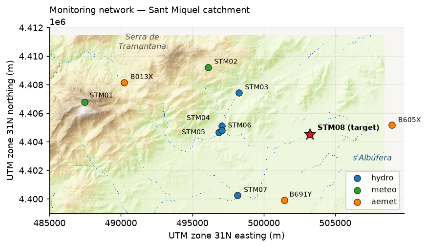
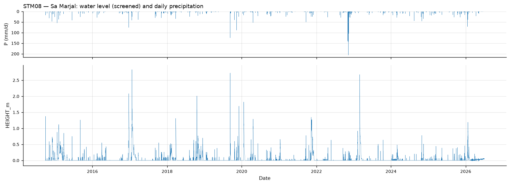
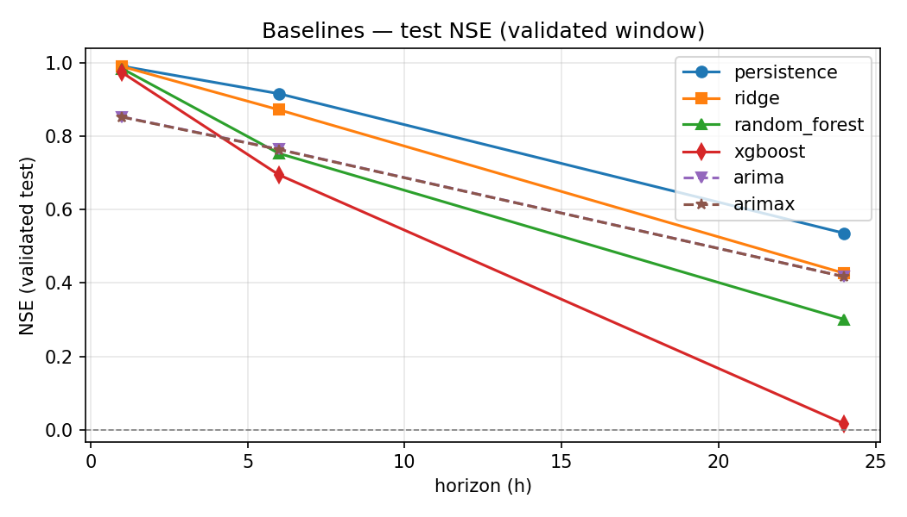

# TFM — Hydrological Modelling of the Sant Miquel Catchment

Master's thesis (TFM): comparison of a physics-based hydrological model
(**HEC-HMS**) with machine-learning models for predicting the water level
(`HEIGHT_m`) at the **STM08 – Sa Marjal** station, using the remaining STM and
AEMET stations as predictors. See `docs/plan_TFM.md` for the full work plan.

## Repository structure

```
├── data/                  # NOT tracked in git (~850 MB, see .gitignore)
│   ├── raw/               #   original, immutable data
│   │   ├── stm/           #     STM01–STM08 station exports (.xlsx + hydro .csv)
│   │   ├── aemet/         #     UIB-Estrany .phor files (B013X, B605X, B691Y)
│   │   └── db_exports/    #     dumps from the internal database
│   │       ├── waterlevel/    #   extension data STM03–STM08 (HEIGHT_m)
│   │       ├── precipitation/ #   extension data STM01–STM02
│   │       ├── discharge/     #   discharge extracts STM03–STM05
│   │       └── raw_B013X_B605X_B691Y_2023_01_01_2026_07_14.csv
│   ├── clean/             #   standardized CSVs + metadata (pipeline output)
│   └── processed/         #   modeling datasets (e.g. dataset_hourly.parquet)
├── scripts/
│   ├── cleaning/          # raw → clean (clean_STM01–08.py, clean_UIB_Estrany.py)
│   └── extension/         # clean → clean+DB extension (extend_*.py)
├── notebooks/             # 01_eda … 07_comparison (per plan)
├── hec_hms/               # HEC-HMS project files
├── results/
│   ├── figures/           # plots for the thesis
│   └── metrics/           # NSE / KGE / RMSE / PBIAS tables
├── thesis/                # LaTeX memoir (IEEEtran template)
└── docs/                  # plan_TFM.md, bitacora.md (lab notebook)
```

## Data pipeline

All scripts resolve their paths from the repository root (via `__file__`),
so they can be run from any working directory.

```bash
pip install -r requirements.txt

# 1. Clean the raw station exports → data/clean/
python scripts/cleaning/clean_STM01.py   # ... through clean_STM08.py
python scripts/cleaning/clean_UIB_Estrany.py

# 2. Extend the clean series with the internal DB exports (run after cleaning)
python scripts/extension/extend_STM_waterlevel.py   # STM03–STM08 (HEIGHT_m)
python scripts/extension/extend_STM_meteo.py        # STM01–STM02 (precip/temp)
python scripts/extension/extend_AEMET_DB.py         # B013X, B605X, B691Y
```

Each clean CSV in `data/clean/` has a companion `*_metadata.txt` with the
start date (`T0`) and the sampling-frequency periods of the station.

## Current results (progress report)

**Status.** Data engineering (Phases 0–2 of `docs/plan_TFM.md`) and the
split-aware baseline benchmark (Phase 4) are complete. The HEC-HMS project
(Phase 3) is initialized but not yet calibrated, and the sequential neural
models (Phase 5) are not yet evaluated; no physical-vs-deep-learning claim is
made at this stage.

**Dataset.** Uniform 10-minute grid over 2014-09-26 → 2026-07-02:
618 769 timestamps, 614 201 supervised samples and 255 predictors, from 8
RiscBal stations + 3 AEMET rain gauges + the internal production-database
extension. Chronological split: train Sep 2014–Dec 2020 (52.9 %),
validation Jan 2021–Jun 2022 (12.8 %), test Jul 2022–Jul 2026 (34.3 %).

**Event catalogue.** 175 flood events under a reproducible
peak-over-threshold rule with a 0.10 m minimum peak level (102 train /
16 validation / 57 test). Mean duration 34.9 h; largest event 87.84 m³/s and
2.83 m at STM08 (Jan 2017).

**Baseline benchmark** (test NSE, full test split; 1 h / 6 h / 24 h):

| Model | t+1 h | t+6 h | t+24 h |
|---|---|---|---|
| Persistence | **0.988** | **0.913** | **0.563** |
| Ridge | 0.987 | 0.876 | 0.472 |
| Random forest | 0.982 | 0.761 | 0.292 |
| XGBoost | 0.972 | 0.721 | 0.091 |
| ARIMA | 0.856 | 0.777 | 0.455 |
| ARIMAX (leakage-free) | 0.855 | 0.776 | 0.454 |

Persistence is the strongest aggregate baseline, as expected in a mostly dry
intermittent system. Ridge is the strongest non-persistence model, while the
tree models overfit the dry regime and generalise poorly at long horizons
(24 h PBIAS: ridge 70.3 %, random forest 116.2 %, XGBoost 138.7 %).
Median per-event NSE is much lower (e.g. persistence 0.184 at 1 h,
−1.18 at 6 h and −2.31 at 24 h), confirming that flood peaks remain the hard
part of the task.

**Key data-quality findings.** Production-database water levels were in
centimetres (critical cm→m fix); quality-2 records were discarded and
quality-1 records audited (STM03: 51 336; STM05: 6 888, transitions ≤ 3/35 mm);
an anomalous DB-only diurnal sensor drift was corrected per station; fixing
sub-minute timestamp offsets restored the STM08 historical maximum from
1.31 m to 2.83 m and the peak discharge from 19.81 to 87.84 m³/s.

**Where to look.**

- Figures: `results/figures/eda/` (`station_map.png`, `stm08_overview.png`
  with daily hyetograph, `ccf_hydro_vs_stm08.png`, `events_summary.png`)
  and `results/metrics/baselines_nse.png`.
- Tables: `results/metrics/baselines_test_split.csv`,
  `baselines_per_event.csv`, `baselines_summary.csv` (NSE, KGE, RMSE, MAE,
  PBIAS, peak errors, POD/FAR/CSI).
- Data reports: `docs/CHANGELOG.md`, `docs/plan_TFM.md`, `notebooks/01_eda.ipynb`.





**Next steps.** (1) Delineate and calibrate HEC-HMS against observed
discharge and validate on independent events; (2) train multi-horizon
LSTM/GRU and TFT models on the same 10-minute table and splits;
(3) compare physical, classical and deep models on common event subsets.

## Thesis

The LaTeX memoir lives in `thesis/` (`document.tex`, IEEEtran template).
Compile with any standard LaTeX toolchain (e.g. `pdflatex` + `bibtex`).
